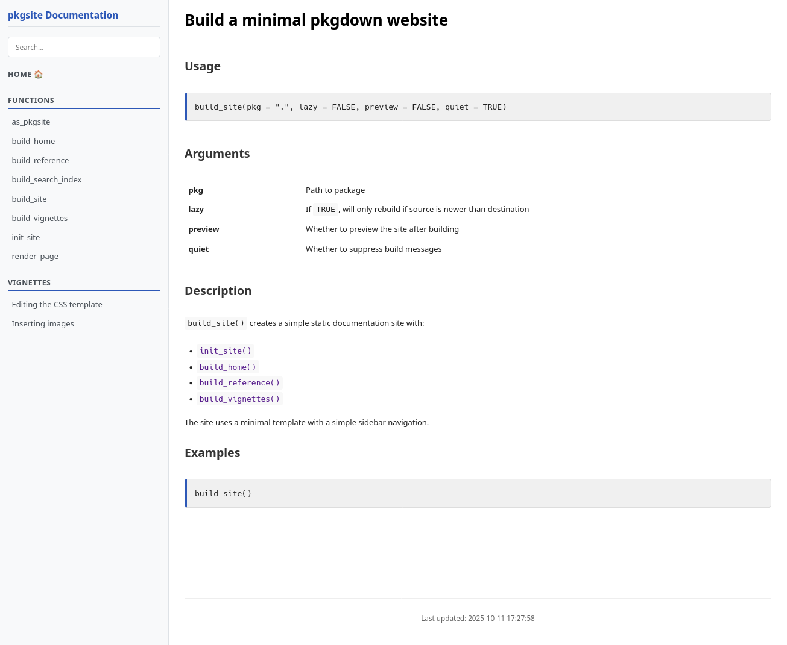

```{r, include = FALSE}
knitr::opts_chunk$set(
  collapse = TRUE,
  comment = "#>"
)
```

Being this a package to build a minimal site, the CSS is very simple and it consists in two files: content.css and
menu.css

You can alter the CSS generated after running `build_site()`. If you open `./docs/content.css`you can apply any
valid CSS, for example by changing this

```css
body {
  margin: 8px;
  padding: 0px;
  font-size: small;
  font-family: "Lucida Grande", "Lucida Sans Unicode", Arial, Verdana, Helvetica, sans-serif;
  background-color: #fff;
  color: #222;
  line-height: 1.5;
}
```

into this

```css
body {
  margin: 8px;
  padding: 0px;
  font-size: small;
  font-family: "Comic Sans MS", Arial, Verdana, Helvetica, sans-serif;
  background-color: #fff;
  color: #222;
  line-height: 1.5;
}
```

The change will be reflected in the site after refreshing the browser.

## Before



## After


